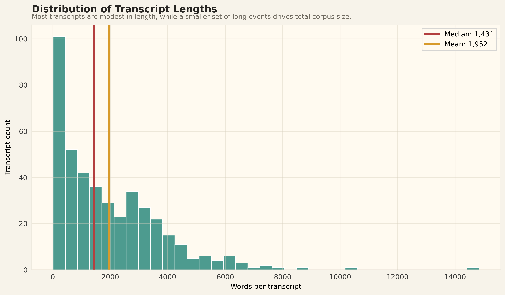
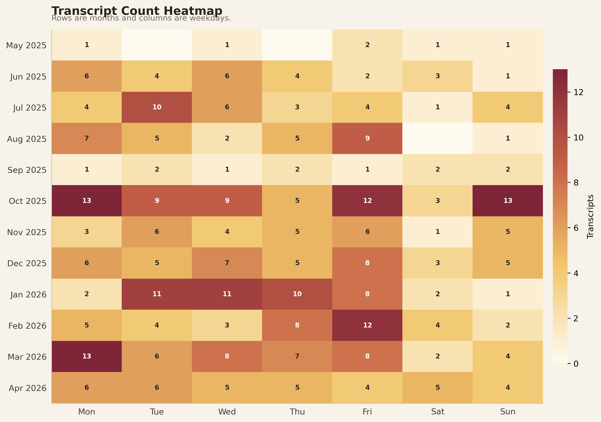
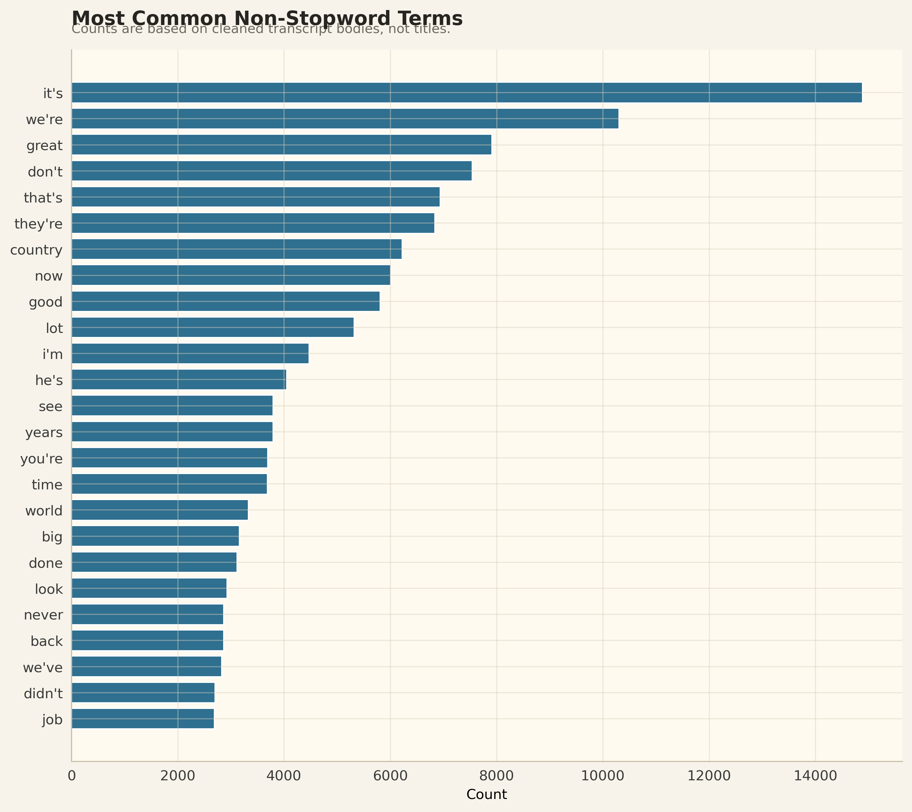
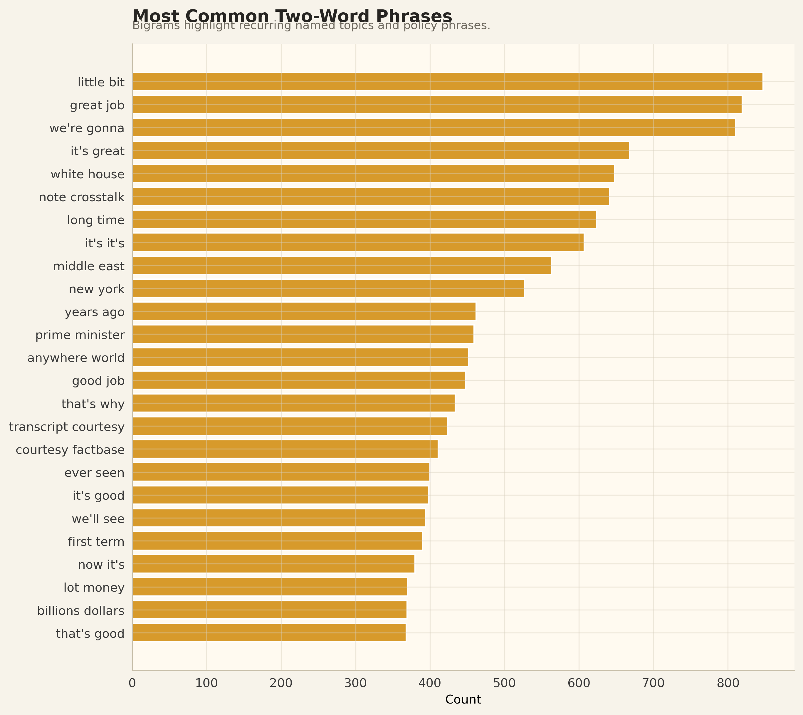
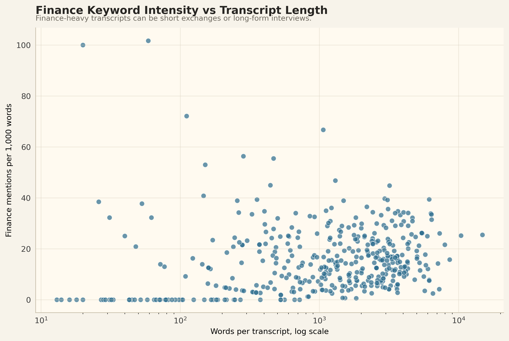

# Bayesian Machine Learning Final Project

## Latent Space Warriors: Political Communication and Market Volatility

This project studies whether political communication events are associated with short-term market volatility. The core dataset combines local transcript text features with market variables such as VIX changes and S&P 500 returns. The modeling workflow identifies volatility regimes, studies transitions between those regimes, and compares NLP-only predictors against models with financial controls.

Raw transcript files live in `transcripts/`, which is ignored by Git. The tracked files are derived datasets, notebooks, and aggregate visual outputs.

## Repository Structure

```text
.
├── final_data/
│   ├── model_ready_dataset.csv
│   ├── finance_enriched_dataset.csv
│   └── transcript_aggregate_features.csv
├── notebooks/
│   ├── baseline_model.ipynb
│   ├── extension_model.ipynb
│   ├── transcript_visualizations.ipynb
│   ├── finance_results.ipynb
│   ├── visualization_results.ipynb
│   ├── prob_effect_comparison.csv
│   └── assets/
├── src/
│   └── transcript_scraper.py
└── transcripts/        # ignored by Git
```

## Data Outputs

- `final_data/model_ready_dataset.csv`: main modeling dataset with NLP topic features, VIX variables, and S&P 500 controls.
- `final_data/finance_enriched_dataset.csv`: finance-style derived fields, including forward returns, drawdowns, realized volatility, VIX shock flags, and risk-off indicators.
- `final_data/transcript_aggregate_features.csv`: transcript-level aggregate features only. This file does not include raw transcript bodies or token lists.

## Transcript Visualizations

Notebook: `notebooks/transcript_visualizations.ipynb`  
Figures: `notebooks/assets/transcript_visualizations/`

This notebook visualizes the transcript corpus using aggregate statistics. It avoids printing raw transcript bodies and exports only aggregate features.

Generated figures:

**Transcript count and total words by month**


**Distribution of cleaned word counts per transcript**



**Transcript count by month and weekday**



**Most common cleaned non-stopword terms**



**Most common two-word phrases**



**Broad keyword themes and share of transcripts mentioning each theme**


**Theme mentions per 1,000 words over time**


**Finance-related keyword counts**


**Theme co-occurrence across transcripts**


**Finance keyword intensity versus transcript length**



Current transcript summary:

- 423 transcript files.
- 403 transcripts with known dates.
- Date range: 2025-05-24 to 2026-04-29.
- 825,492 cleaned words.
- Median transcript length: 1,431 cleaned words.

## Finance Visualizations

Notebook: `notebooks/finance_results.ipynb`  
Figures: `notebooks/assets/finance_results/`

This notebook derives market-style results from the model-ready data. It adds forward S&P 500 returns, VIX forward changes, drawdowns, realized volatility, VIX shock flags, and risk-off day indicators.

Generated figures:

**S&P 500 level, VIX level, and S&P 500 drawdown**


**Average forward S&P 500 returns after low-, medium-, and high-VIX-move days**


**Event-study view around top-decile absolute VIX moves**


**Relationship between S&P 500 daily returns and daily VIX changes**


Current finance summary:

- 183 market observations.
- S&P 500 total return over the sample: about 20.5%.
- Maximum S&P 500 drawdown: about -9.1%.
- Average VIX: 18.40.
- Maximum VIX: 31.05.

## Model Result Visualizations

Primary notebooks:

- `notebooks/baseline_model.ipynb`
- `notebooks/extension_model.ipynb`
- `notebooks/visualization_results.ipynb`

Figures:

- `notebooks/assets/`
- `notebooks/assets/additional_visualizations/`

The baseline notebook fits a three-state volatility-regime model and then uses transition classifiers to test whether NLP topic features help predict next-period volatility states. The extension notebook fits a Bayesian multinomial transition model to quantify uncertainty in those effects. The visualization notebook creates presentation-ready plots from the model outputs.

Generated model-result figures:

**VIX over time colored by inferred volatility state**


**Strongest NLP predictors of high-volatility transitions**


**Strongest NLP predictors of low-volatility transitions**


**Coefficient stability after adding financial controls**


**Compact timeline of inferred volatility regimes**


**HMM transition probability heatmap**


**NLP topic coefficients for high-volatility transitions**


**Topic effects before and after financial controls**


**Bayesian probability-effect intervals**


**Probability changes with and without financial controls**


**Average topic score by volatility regime**


**NLP-only versus full-model confusion matrices**


**Largest VIX-move days annotated on the VIX series**


**Accuracy, macro F1, high-state precision, and high-state recall**


Key model findings:

- The regime model separates low-, medium-, and high-volatility movement days.
- High volatility is persistent once entered.
- NLP-only transition models show suggestive topic effects for high-volatility transitions.
- Adding financial controls improves classification performance and shrinks many NLP topic effects.
- The Bayesian extension shows substantial uncertainty around most topic effects.

## Transcript Scraper

Script: `src/transcript_scraper.py`

The scraper collects transcript pages from the Senate Democrats Trump Transcript Archive and saves each transcript as a `.txt` file under `transcripts/`.

Each transcript file follows this structure:

```text
<title>

===== TRANSCRIPT BEGIN =====

<transcript body>
```

The `transcripts/` directory is listed in `.gitignore`, so raw transcript files are not tracked by default.

## Requirements

The notebooks use common Python data-science packages:

```bash
pip install pandas numpy matplotlib scikit-learn jupyter
```

The baseline model notebook also uses:

```bash
pip install hmmlearn
```

The Bayesian extension notebook uses:

```bash
pip install pymc arviz pytensor
```

The scraper uses:

```bash
pip install requests beautifulsoup4
```

## Reproducing the Current Outputs

Run notebooks from the `notebooks/` directory:

```bash
jupyter nbconvert --to notebook --execute transcript_visualizations.ipynb --inplace
jupyter nbconvert --to notebook --execute finance_results.ipynb --inplace
jupyter nbconvert --to notebook --execute visualization_results.ipynb --inplace
```

The Bayesian extension can take much longer because it samples posterior distributions with PyMC.
